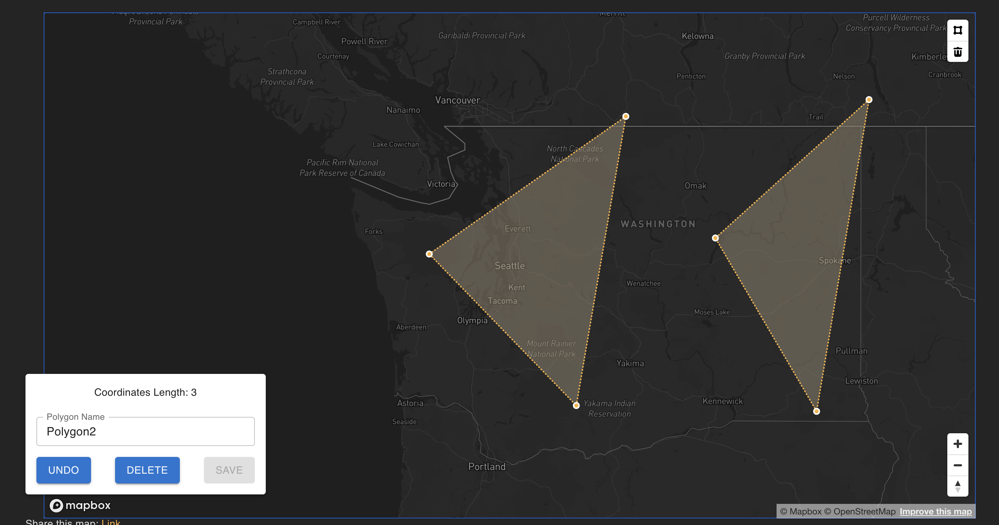

# React + Vite

### Tools

React / Vite
Serverless to deploy
Material for some light styling
Apollo Client for server connection and running query/mutation hooks

### Known Issues/Things to Improve

Just like in all mapbox maps, you can select multiple features. This app should only let you select - since the main goal is to view one at a time and update one at a time.


It doesn't look like mapbox has an easy way to just default to only allowing users to select one feature at a time. This is an idea to add a click listener

```
let selectedFeatureId = null;

map.on('click', 'my-layer', function (e) {
    if (selectedFeatureId !== null) {
        // Deselect the previously selected feature
        map.setFeatureState(
            { source: 'my-data', id: selectedFeatureId },
            { selected: false }
        );
    }

    // Select the new feature
    selectedFeatureId = e.features[0].id;
    map.setFeatureState(
        { source: 'my-data', id: selectedFeatureId },
        { selected: true }
    );
});

map.on('mouseenter', 'my-layer', function () {
    map.getCanvas().style.cursor = 'pointer';
});

map.on('mouseleave', 'my-layer', function () {
    map.getCanvas().style.cursor = '';
});
```

The below deselect is not working, but is the idea that I am going with. On selecting, if there is more than one feature, I will deselect the additional ones.

```
mapRef.current.on('draw.selectionchange', (e) => {
      if (e.features.length > 0) {
        setSelectedFeature(e.features[0]);
        e.features.forEach((feature, index) => {
          if (index !== 0) {
            //TODO this isn't deselecting, but
            mapRef.current.draw.deselect(feature.id);
          }
        });
```
